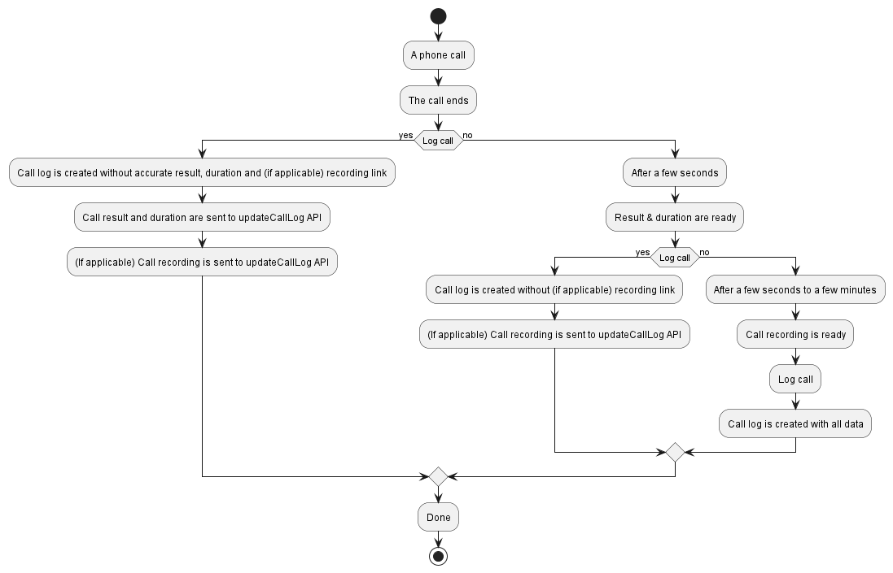

# Call log flow

Call logs won't be ready right after a call ends. RingCentral needs to do some pre-processing on call data. 

If a call is logged after a while and all data is ready, then it would be a event to create a call log.

If a call is logged immediately after it ends, there will be 2 to 3 events depending on if the call is recorded or not. If not recorded, there will be a create call log event and then followed by 1 or 2 update call log events with data that just becomes ready.

Here's its flow:

For more details, please refer to createCallLog and updateCallLog interfaces.

# How to add data fields to logs

In most CRMs, there may not be custom fields for log entities. Commonly, a text field is where we can put log data in. Therefore, string manipulation is our topic here. We recommend using string upsert to make sure data will always be inserted and not require strict formatting. 

For example, agent notes can be added as:

    - Agent notes: {notes}

And the code should check for string mathcing "- Agent notes: *", and then replace "*" with updated notes. If it's a no found, then insert a new line of "- Agent notes: {notes}".

# Call recordings

Call recordings are typicaly presented as in recording view link where users can go to its page and authorize their RingCentral accounts then listen to or download it.

If you want to download the file, there is a way to do it. Here's how:

    1. `recordingDownloadLink` are presented in both createCallLog and updateCallLog methods. In createCallLog, it's under `callLog.recording.downloadUrl` and in updateCallLog, it's as a input parameter `recordingDownloadLink`. 
    2. `recordingDownloadLink` looks like https://{domain}/{path}?accessToken={accessToken}. You'll need to compose a GET call as: GET https://{domain}/{path} , with header containing Bearer token as {accessToken}
    3. Recording file will be returned by the GET call, in audio/mpeg or audio/wav format. (Details here: https://developers.ringcentral.com/api-reference/Call-Recordings/readCallRecordingContent)

# AI data

There are two types of AI data.

1. Summary - in input of both createCallLog and updateCallLog as `aiNote`
2. Transcript - in input of both createCallLog and updateCallLog as `transcript`