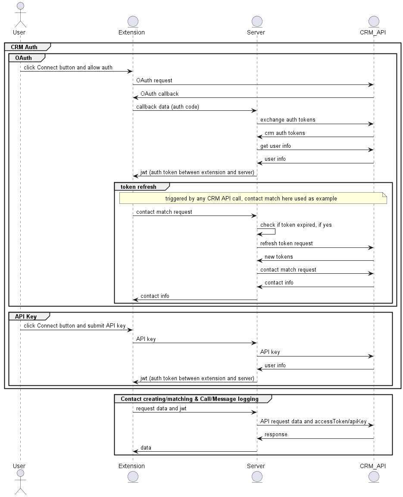

# Implementing your CRM adapter

{! docs/developers/beta_notice.inc !}

Each adapter will be configured to communicate with the server shell. While the [sample adapter](https://github.com/ringcentral/rc-unified-crm-extension/blob/FrameworkRefactor/src/adapters/testCRM/index.js) that is provided through this framework is implemented in Javascript, you are free to implement your server in whatever language you prefer -- provided that it implements the interface properly. 

Overall, to implement your own adapter, there are 2 files to be created under `src/adapters/{newCrm}` folder:

1. `index.js`: implements given interfaces (mostly to make API calls to CRM platform)
2. `manifest.json`: defines and governs app behaviors

!!! tip "Quick start"
    It is highly recommeded that you look at [Quick Start](./quick-start.md) before starting your development.

## Flow

## Working examples

We have 5 natively supported CRMs which can be used as references.

|CRM|Auth type|Contact type|Note|
|------------------|-----------------|-------------|-------------|
|Clio|OAuth|Contact|Clio API only supports exact match for contact match by phone number, so users need to use [overriding formats](../users//settings.md#phone-number-formats)|
|Pipedrive|OAuth|Contact|Pipedrive has unique auth process behind OAuth, it's not recommended to be used as OAuth reference|
|Insightly|api key|Lead and Contact|Insightly API only supports exact match for contact match by phone number, so users need to use [overriding formats](../users//settings.md#phone-number-formats)|
|Bullhorn|OAuth|Candidate and Contact|Bullhorn has unique auth process behind OAuth, it's not recommended to be used as OAuth reference|
|Redtail|api key (username & password)|Contact|None|

## Development

Now let's start the development of a new adapter.

### Setup development environment

Please refer to server and client setup on [Quick Start](quick-start.md).

### Implmentation 

Each adapter will need to implement the following interfaces. Let's start by duplicating `testCRM` folder and files, and then replace `testCRM` in folder name and platform names in `manifest.json` with the CRM that you want to add.

* [Authorization](auth.md)
* [Contact lookup and matching](contact-matching.md)
* [Logging, updating and looking up call logs](logging-calls.md)
* [Logging SMS messages](logging-sms.md)
* [Creating placeholder contacts](placeholder-contacts.md)

## Deployment

If the adapter is all setup and running on your localhost, you can then deploy to the cloud. [Default deployment method](deploy.md) uses `serverless framework` and deploys to AWS lambda. Alternatively, you can `npm run build` the nodejs server to `build` folder and deploy elsewhere.