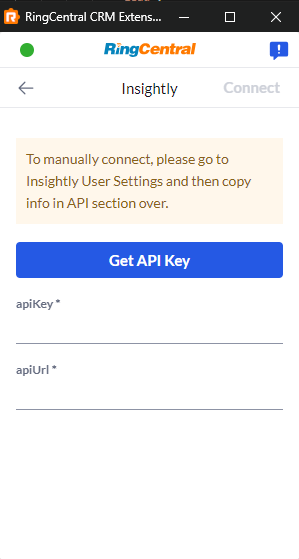

# Configuring your adapter

{! docs/developers/beta_notice.inc !}

Each adapter provides a configuration that in some ways also acts as a manifest file. The config file not only provides key pieces of metadata to enable the framework to connect to the CRM, and display other properties to the user (name and so forth), but it also allows developers to customize the appearance of screens, add custom fields to various CRM object types, and more. Here is a list of things the config file enables for developers:

* Provide CRM connectivity and authorization details
* Define custom fields for:
    * call logging and disposition
    * SMS and messagig logging
* Customize the "Connect to CRM" or authorization screen
* Define custom contact record types/categories
* Customize the welcome screen for a given CRM

## Config file

TODO - describe where the config file is

## Configuration options

| Name             | Type            | Description |
|------------------|-----------------|-------------|
| `urlIdentifier`  | string          | The URL for which this CRM will be enabled. When the CRM is enabled for a domain, the extension's organge quick access button will appear. |
| `name`           | string          | The name of the CRM. |
| `authType`       | string          | The supported auth type for the corresponding CRM. Only two values are supported: `oauth` and `apiKey`. |
| `authUrl`        | string          | Only used with `authType` equal to `oauth`. The auth URL to initiate the OAuth process with the CRM. |
| `clientId`       | string          | Only used with `authType` equal to `oauth`. The client ID of the application registered with the CRM to access it's API. |
| `canOpenLogPage` | boolean         | Set to `true` if the corresponding CRM supports permalinks for a given activity/log. When set to `true` users will have the option view/open the activity log in the CRM from the call history page. When set to `false`, users will open the contact page instead. |
| `contactTypes`   | ARRAY of string | CRMs often adopt unique vernaculars to describe contacts. Provide the enumerated list of contact types supported by the corresponding CRM. |

## Customizing the welcome message

When a user installs the CRM extension for the first time and accesses it from their CRM, a welcome page or splash screen appears to the user. This screen can be very effective in educating the end user about how to setup and connect to the associated CRM. 

Currently welcome pages are relatively simple, providing developers with the ability to direct users to two key resources:

* A URL to watch a video
* A URL to read documentation

```js
{! client/src/config-copy.json [ln:54-59] !}
```

## Customizing pages within the client application

There are a number of pages within the Unified CRM client application that often need to be customized in some way for the corresponding CRM. Those pages are:

* CRM authentication page
* Call logging form
* Message logging form

### Authentication page

=== "Sample adapter"

```js
{!> client/src/config-copy.json [ln:16-26] !}
```

=== "Insightly adapter"



```js
<!--{!> client/src/config-copy.json [ln:113-140] !}-->
```

### Adding custom fields to logging forms

CRMs almost always have a set of fields associated with logging an activity that are relatively unique. Consider for example Clio, a CRM used by legal professionals, in which users link calls to "matters" (e.g. a "legal matter"). Where CRMs like Insightly link calls to opportunities. To account for this, the framework makes it easy to add new custom form fields to two key forms users interact with frequently:

* Call logging page
* Create contact page

For each page, you will define an array of `additionalFields`. Each additional field element consists of the properties below.

| Name               | Type    | Description |
|--------------------|---------|-------------|
| `const`            | string  | A unique key identifying the field. |
| `title`            | string  | The display name of the field. |
| `type`             | string  | The data type associated with the field. |
| `contactDependent` | boolean | Set to `true` if this field would change when the selected contact is changed, or `false` if the value is static.  |

#### Custom call log fields

Set up associated deals as dropdown options:
1. Christmas special A351
2. Easter A22
3. Anniversary C92

and address as free input field.

```js
{! client/src/config-copy.json [ln:27-42] !}
```

#### Custom SMS log fields

Set up associated deals the same as call log

```js
{! client/src/config-copy.json [ln:43-52] !}
```

## Sample config file

Here is a [sample config file](https://github.com/ringcentral/rc-unified-crm-extension/blob/FrameworkRefactor/client/src/config-copy.json) that illustrates the full syntax and structure of the config file. 

```js
{! client/src/config-copy.json !}
```
