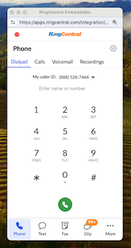
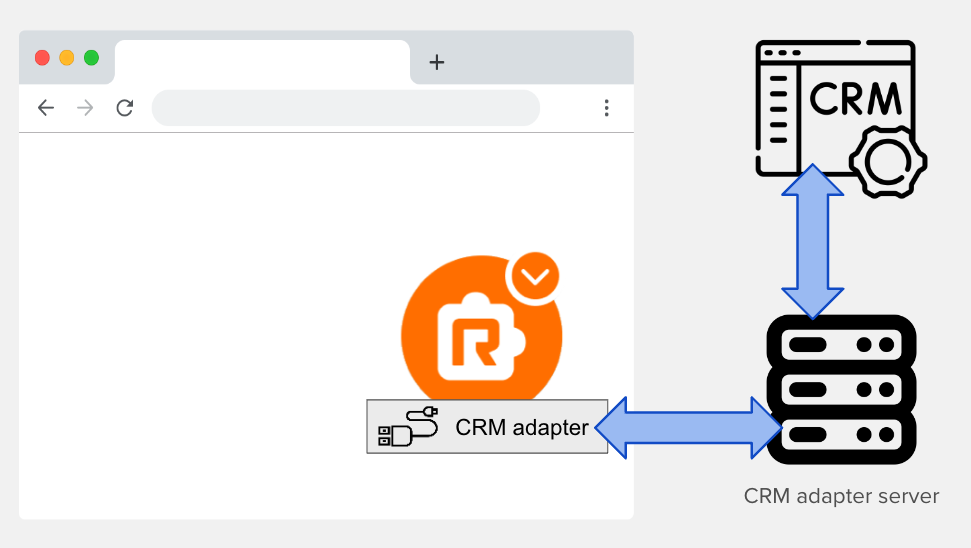

# Integrating with CRMs using the Unified CRM extension framework

{! docs/developers/beta_notice.inc !}

Welcome to RingCentral's Unified CRM integration framework. Using this framework, developers can integrate RingCentral into their web-based CRM more easily. The framework is centered around enabling the following features common to many CRM integrations:

* **Embedded phone**. Injecting a phone into the CRM for a fully-integrated communications experience.
* **Call pop**. Automatically opening up a contact record when a call is received.
* **Logging calls**. Capturing and storing call notes in an activity record linked to an associated contact in the CRM.

!!! info "Powered by RingCentral Embeddable"
    { align=right }
	
	The Unified CRM integration framework is build on top of [RingCentral Embeddable](https://ringcentral.github.io/ringcentral-embeddable/), which itself provides the following capabilities via its unified communications client:

    * Make and receive phone calls.
    * Send and receive SMS.
    * Read and send team chat messages. 
    * Search your RingCentral address book.
    * View a history of past calls.
    * Listen to call recordings.
    * Access and listen to voicemail. 

## Architectural overview

Each CRM supported by this framework is required to implement what is referred to as an "adapter." Adapters help broker communications between the client application (the dialer and primary user interface) and the CRM being integrated with. 

(TODO: below image needs to be updated to remove CRM adapter on client side)

Each adapter implements the following components:

* A configuration file, or manifest that defines basic metadata and provides a no-code interface for defining common user interactions. 
* A server that implements a prescribed interface that is invoked by the front-end client to perform more complex interactions with the CRM. 

In this guide, you will learn how to build, package and distribute an adapter for a CRM.

[Checkout the Quick Start](quick-start.md){ .md-button .md-button--primary }
