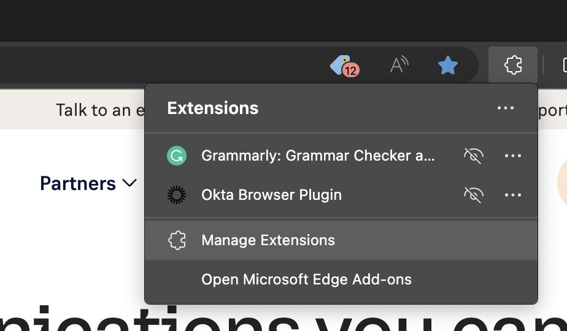
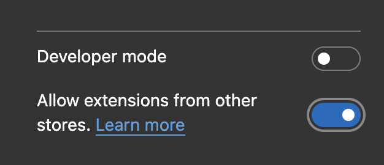

# Setup and installation

RingCentral's Unified CRM extention for Google Chrome and Microsoft Edge is available via the Chrome web store. Installation is quick and easy if you are accustom to installing browser extensions. Click the web store button below to get started. 

<figure markdown>
  
  <figcaption>Install the extension now</figcaption>
</figure>

## Installing the browser plugin

### Google Chrome

The Unified CRM extension was initially architected for Google Chrome, and is therefore installed easily from the [Google Chrome web store](https://chromewebstore.google.com/detail/ringcentral-crm-extension/kkhkjhafgdlihndcbnebljipgkandkhh). Click the "Add to Chrome" button to install the extension instantly. Then, consult the instructions specific to your CRM.

### Microsoft Edge

Microsoft Edge supports most Chrome extensions. To install them, however, you will need to [make configuration changes](https://support.microsoft.com/en-us/microsoft-edge/add-turn-off-or-remove-extensions-in-microsoft-edge-9c0ec68c-2fbc-2f2c-9ff0-bdc76f46b026) to Edge. In summary:

1. In Microsoft Edge, navigate to the [Manage extensions](edge://extensions/). 

    { style="max-width: 250px"}

2. Select "Allow extensions from other stores" in the banner at the top of the page, then select "Allow" to confirm.

    { style="max-width: 250px"}

3. Navigate to the [Unified CRM extension](https://chromewebstore.google.com/detail/ringcentral-crm-extension/kkhkjhafgdlihndcbnebljipgkandkhh) in the Chrome web store and select "Add to Chrome."

4. Follow any additional prompts to complete the installation process. 

## Connecting to your CRM

The process of connecting the Unified CRM extension to your CRM is more or less the same at a high-level. 

1. First, navigate to and login to your CRM. 
2. While viewing a page in your CRM, open up the CTI.
3. Open the "More" tab and select "Settings."
4. Scroll down to find your CRM, and click the "Connect" button. 
5. Follow the on-screen instructions for your CRM. 

Each CRM may have a slightly different approach in order to install the extension fully. Consult the CRM-specific documentation to setup and configure your CRM below.

* [Connect and setup Bullhorn](./bullhorn.md)
* [Connect and setup Clio](./clio.md)
* [Connect and setup Insightly](./insightly.md)
* [Connect and setup Pipedrive](./pipedrive.md)
* [Connect and setup Redtail CRM](./redtail.md)

