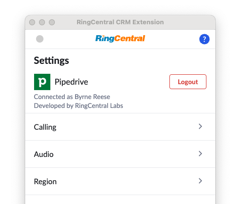

# Setting up the Unified CRM extension for Pipedrive

Pipedrive is designed to help small businesses grow. For over ten years, Pipedrive has been committed to building the best CRM – a CRM by and for salespeople. The result is an easy-to-use, effective sales tool that centralizes your data, helping you visualize your entire sales process and win more deals.

RingCentral's integration with Pipedrive helps streamline communications between customers, and helps sales staff to better support them through their entire lifecycle by helping to manage and store communication history with customers, capture important communication metadata and more.

## Install the extension

If you have not already done so, begin by [installing the Unified CRM extension](../getting-started/) from the Chrome web store. 

## Setup the extension

Once the extension has been installed, follow these steps to setup and configure the extension for Pipedrive. 

1. [Login to Pipedrive](https://app.pipedrive.com/auth/login).

2. While visiting a Pipedrive application page, click the quick access button to bring the dialer to the foreground. 

3. Navigate to the Settings screen in the Unified CRM extension's CTI, and find the option labeled "pipedrive."

    { style="max-width: 200px" }

4. Click the "Authorize" button. 

5. A window will be opened prompting you to enter your Pipedrive username and password. Login to Pipedrive. 

When you login successfully, the Chrome extension will automatically update to show you are connected to Pipedrive. If you are connected, the button next to Pipedrive will say, "unauthorize."

And with that, you will be connected to Pipedrive and ready to begin using the integration. 