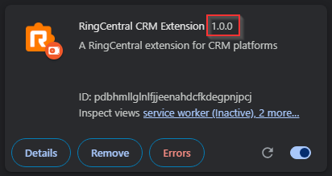

# Support and troubleshooting

## Always make sure you are running the latest version

The Unified CRM extension is frequently updated with fixes and feature enhancements. While the extension is updated automatically, you may need to restart your browser in order for those updates to take effect. 

In rare circumstances, due to voodoo and other supernatural forces, uninstalling and reinstalling the extension has been known to fix some problems. 

## "I don't see an 'Authorize' or 'Connect' button to login to my CRM"

In order to determine which CRM to connect to, you need to launch the extension while visiting and logged into your CRM application. The Unified CRM extension will detect from the domain you are visiting to determine which CRM to prompt you to connect to. If you launch the CRM extension from any other domain, you will not see an Authorize or Connect button. 

## Unable to find contact

One of the most common challenges arises from phone calls for which a corresponding contact record in the CRM cannot be found. However, you know for sure the contact exists.

When this happens it is almost certainly related to a failed lookup of the contact based on the given phone number. A lookup can fail in some CRMs:

1.  If the phone number stored in the CRM does not EXACTLY match the phone number as seen in the Unified CRM extension. This is due to limitations in the connected CRMs' APIs. 
2.  If you have just created it and the CRM server usually doesn't reflect the change immediately. Some CRMs have refresh clock to update all changes every X seconds/minutes. So if it's just created and can be seen on CRM webpages, please wait for a couple of minutes and it should then be fetched to the extension.

There are two ways to fix the issue:

1. Update the contact record's phone number so that it conforms to the E.164 standard. This will be the most reliable solution and the most performant. However, reformatting the phone numbers across a huge contact database may not be feasible or practical. 

2. Update the advanced configuration settings of the Unified CRM extension to add the phone number formats commonly used by your company. The Unified CRM extension will then search for contacts using each of the phone number formats stored with us. This solution is easier to deploy, but can sometimes introduce latencies as multiple API calls are needed to successfully find a contact. 

## Submitting feedback

If at any point you would like to report an issue, suggest a feature or provide feedback of any kind, please click the feedback icon in the upper-righthand corner of the extension. From there, tell us your CRM and send us your feedback. 

## Managing software updates

Updates to the Unified CRM extension are installed automatically by Chrome and Edge when you restart your browser. You can see what version of the Unified CRM extension is currently installed by navigating to the "Manage extensions" area of your browser, finding the Unified CRM extension in your list of installed plugins, and clicking "Show details." On the resulting page you can see the currently installed version. 

{ style="width:50%" }

To ensure you are actively running the most recent version, please restart your browser. 

