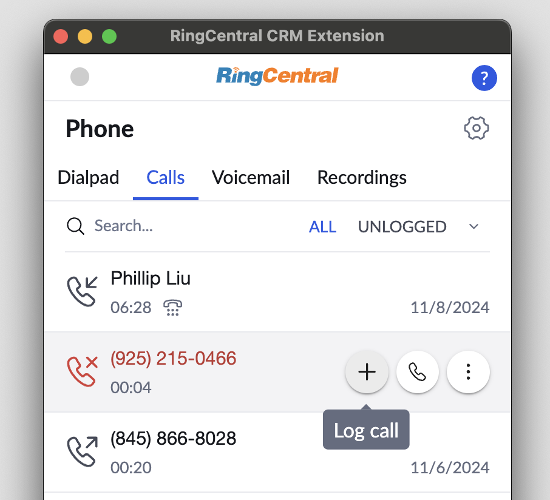
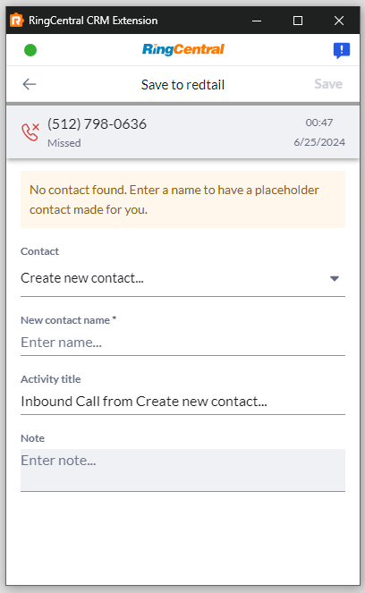

# Logging phone calls in the CRM

One of the central features of the Unified CRM extension is the ability to automatically log calls that are received or placed while the extension is active. All calls made or received can be logged manually. To manually log a call, open the "Call history" tab in the extesion, find the call you wish to log in the list, and click the call log icon. You will then be prompted to enter call notes for the call. Clicking "save" will result in the call be logged, associated with the proper contact, and any notes you entered being saved with the associated activity.

<figure markdown>
  
  <figcaption>The Unified CRM extension quick access button</figcaption>
</figure>

If you wish to edit a call you have previously logged, you will need to do so from within your CRM directly. Once a call has been logged using the extension, it cannot be edited by the extension.

## Logging calls when no contact is found

In order for a call to be logged properly, a contact record within the connected CRM must exist and be associated with the phone call. Calls are matched to a contact via the phone number associated with the call.

When no contact can be found associated with a given phone number, the Unified CRM extension makes it easy to create a placeholder contact associated with the corresponding phone number. To create a placeholder contact, provide the name of the contact and the extension will do the rest. 

<figure markdown>
  
  <figcaption>Creating a placeholder contact in the connected CRM</figcaption>
</figure>

It is the intention for someone to edit the placeholder contact after the call has been logged, to make sure all the correct and appropriate information about the contact has been captured. 

!!! tip "What if no contact was found, when a contact is known to exist?"
    Sometimes a contact is not found, even though one knows for a fact that the contact exists. This happens with some CRMs whose search mechanisms are overly strict. You can address this through [advanced settings](settings.md#phone-number-formats).
	
## Logging calls when multiple possible contacts found

When logging calls, a call must be associated with one and only contact record. But what happens if more than one contact in the CRM shares the same phone number? This is common when communicating with multiple employees from the same company, as it is not uncommon for the incoming phone number of two employees in the same building to present incoming phone numbers of their company's main company number. 

When multiple contacts are found, users are given an opportunity to disambiguate and select the correct contact record. This is done via a pull-down menu on the call logging screen. 

<figure markdown>
  
  <figcaption>Disambiguating between contacts when multiple matches are found in the connected CRM</figcaption>
</figure>

## Automatically logging calls

!!! note "What to expect from logging call automatically"
    The Unified CRM extension does have the ability to automatically log calls for its users, but it is not designed to be an all-purpose call logging solution. So use it successfully to log calls, it is important to understand what it can and cannot do:
	
    * It CAN automatically log the calls for any user who has the extension installed, and has connected the extension to both RingCentral and their CRM.
	* It CANNOT log calls for anyone who does not have the extension installed in their browser. 
	* It CANNOT log calls for anyone who has not connected the extension to their CRM. 
	* It CANNOT log calls automatically for people who browser is closed. 
		
The Unified CRM extension can be configured to log calls automatically so that you do not need to remember to do so manually. To log calls automatically, there are two configuration parameters that are relevant to you. Both of these parameters can be found under Settings accessed from the More tab.

* **Auto log call/SMS**. This is to turn on auto log feature which will always attemp to log your calls/messages unless any conflict found. A conflict can come in different forms, eg. multiple matched contact for one number.
* **Auto log call/SMS - only pop up log page**. This is a sub-setting under auto log. With it ON, instead of log it in the background, the extension will only open up the log form and you will need to manually log it. This is especially helpful when your work involves taking notes in the log or selecting specific associations with the event.

!!! warning "Auto-logging calls require you to be logged in"
    Users should be aware that calls received while the browser is closed, or while the extension is not actively running will *not* be logged automatically. They will however be logged the next time the CRM extension is active. 

### How to resolve logging conflicts

If you have "Auto log call" enabled under Settings, then whenever a call is received or placed that cannot be logged automatically, then a new tab will appear called "Unresolve." Within this tab, calls with various logging conflicts will queue up for the user to resolve. 

In most cases, there are three reasons a call cannot be logged. 

1. **No contact found**: A contact could not be found in the CRM associated with the associated phone number. When this happens, a new contact must be created, or the actual contact record in the CRM should be updated with the phone number in question. 

2. **Multiple contacts found**: More than one contact was found with the associated phone number. To log this call, a contact record needs to be selected for the note/activity to be associated. 

3. **Multiple associations found**: In some CRMs, a call/SMS log can be associated with other entities. A quick example would be, a contact has two orders.

**How do you know if a contact record has been found?**

You will know if a contact record has been found if you see a contact's name in the call history tab of the Unified CRM extension. If you see a phone number only, chances are a contact record could not be found. 

*Pro tip: you can still log the call as long as you fill in a contact name in the call log form for the extension to create a placeholder contact and then log the call against it*

## Logging past calls

The Unified CRM extension has the ability to automatically log calls in your connected CRM (see "Automatically logging calls" above). However, for calls to be logged automatically, the extension must be actively running. So if you receive a call overnight for example, the next morning when you login, you can navigate to the Call History tab, see the calls you missed, and click the call log icon to record notes or call disposition for that particular call. 

What you are prompted to log will vary depending upon the CRM you are connected to, as we tailor the logging behavior to best fit with the conventions of the corresponding CRM. 

