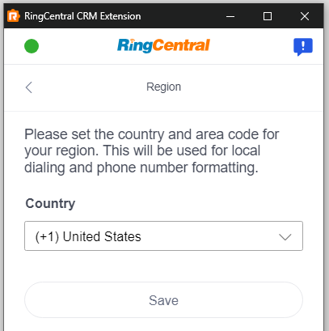
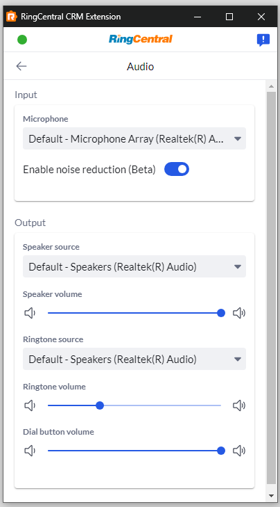
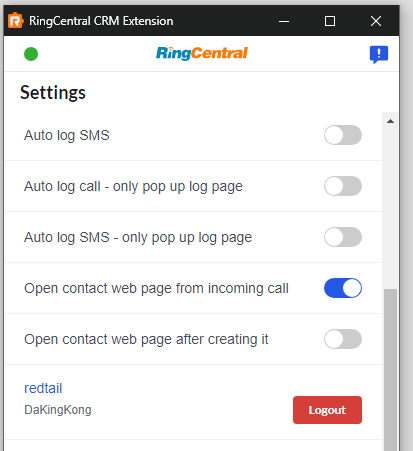
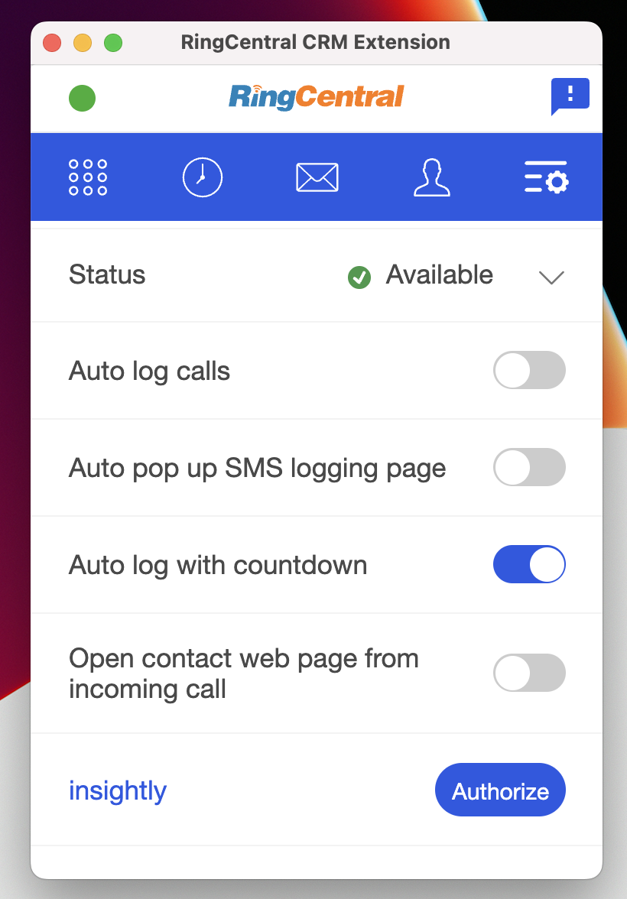
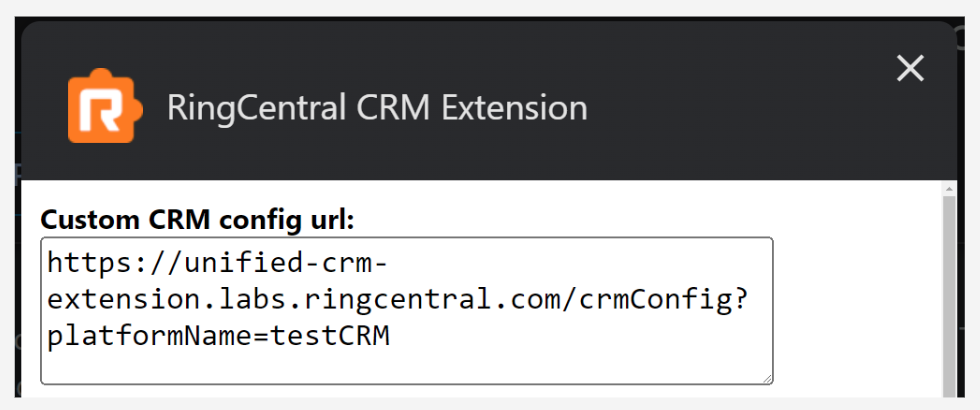

# Settings and preferences

The Unified CRM extension provides numerous options so that end-users can customize their specific settings and experience. 

*Please note that currently all options are user-specific. Account-wide configuration options are not supported.*

Below you will find information on the various ways in which the CRM extension can be configured and customized. You can access all of these options from the Settings page accessed from the More menu. 

## Setting your preferred phone device

RingCentral customers may sometimes have multiple devices or ways of initiating a phone call. To better control what device you use for placing calls, from the Settings screen select "Calling." Then, select the device you prefer to use. Options include the following:

<figure markdown>
  { style="max-width:300px" }
  <figcaption>The settings screen for changing your preferred device for placing calls</figcaption>
</figure>

### Config options

* **Browser**. Select this if you wish to place calls using the CRM extension itself. 
* **RingCentral App**. If you prefer to use the main RingCentral desktop app to make calls, select this. 
* **RingCentral Phone**. This option is not recommended as RingCentral Phone is no longer supported. However, if you still have this app installed and if you prefer to use it, select this. 
* **RingOut**. RingOut is helpful if you prefer to make a call from your desk phone. When RingOut is selected you will be called, and your desk/hard phone will ring. Answer the phone and we will then connect you to the person you are calling. 

## Changing your region and default area code

To customize your default country and area code, from the Settings screen select "Region." Then enter your preferred defaults. 

<figure markdown>
  { style="max-width:300px" }
  <figcaption>The settings screen for modifying your locale</figcaption>
</figure>

## Customizing your preferred audio devices

To customize your preferred input and output devices, e.g. headphones, laptop speakers, etc, from the Settings screen select "Audio." Then select your preferred default devices. 

<figure markdown>
  { style="max-width:300px" }
  <figcaption>The settings screen for customizing audio devices</figcaption>
</figure>

## Toggling the call-pop feature

The term "call-pop" refers to opening a page about an incoming caller automatically so that the person making (or receiving) the call can see all of the relevant information about that person prior to answering the phone. You can easily toggle this feature on and off using this toggle. 

<figure markdown>
  { style="max-width:300px" }
  <figcaption>The settings screen for toggling call-pop</figcaption>
</figure>

## Automatically prompt to capture call notes

Many end users would like confidence in knowing that every call they place or receive is logged properly in the CRM they are connected to. Furthermore, users also want to be prompted to capture notes about a call immediately upon a call ending. To automatically be prompted to enter and save notes relating to a call that has just ended, enable "Prompt to enter notes when calls end" from the Settings page. 

<figure markdown>
  { style="max-width:300px" }
  <figcaption>The settings screen to enable prompting the user to enter notes after a call</figcaption>
</figure>

## Automatically prompt to capture SMS and text messaging notes

As with phone calls, many end users would like to reliably capture the SMS messages transmitted to contacts. To be prompted automatically to enter notes upon sending an SMS, enable "Prompt to enter notes after sending SMS" from the Settings page. 

<figure markdown>
  { style="max-width:300px" }
  <figcaption>The settings screen to enable prompting the user to enter notes after sending an SMS</figcaption>
</figure>

## Automatically log calls and SMS messages

Sometimes users may not be present at their computer when a call is received, yet they still wish to record the call was received and possibly that the call was never responded to. To ensure all calls are captured whether you are present or not, enable "Auto-log save delay."

<figure markdown>
  { style="max-width:300px" }
  <figcaption>The settings screen for automatically logging a call after set number of seconds</figcaption>
</figure>

When this is enabled, the call will be logged automatically after a set number of seconds, which can be configured under "Advanced configuration options" below. If you have also configured the extension to prompt you to enter notes automatically, then you will observe that when a call ends the call log form appears, and a auto-save timer will start. If you do not interact with the form before the timer runs out, the call be logged automatically. 

## Open contact page after creating it

Users can directly create placeholder contacts from within the extension so to make call logging efficient. Placeholder contacts would normally be created with just name and phone number. If users want to edit the placeholder contact further on its CRM webpage, "Open contact page after creating it" setting can be turned on to automatically open contact page after the creation.

## Advanced configuration options

Most users will not need to access these advanced configuration options. However, they have been provided to assist in resolving less common, low-level challenges. These options can be accessed both in Chrome and Edge by opening the "Manage Extensions" area from the Window menu, or from the extension menu found adjacent to your browser's location bar. 

* Open [Manage extensions](chrome://extensions/) in Chrome
* Open [Manage extensions](edge://extensions) in Microsoft Edge

**Finding advanced settings**

To access advanced settings, in your browser, navigate to "Manage Extensions," or just "Extensions." From there locate "RingCentral CRM extension" and click "Show Details."

<figure markdown>
  { style="max-width:400px" }
  <figcaption>An excerpt from the extension details page for the Unified CRM extension</figcaption>
</figure>

Then scroll down near to the bottom and click "Extension options" to open the dialog below.

<figure markdown>
  { style="max-width:400px" }
  <figcaption>Unified CRM extension options. Users may see a slightly different set of options depending upon the version they are using.</figcaption>
</figure>

### Loading custom CRM adapter

The Unified CRM Chrome extension comes bundled with a number of CRM adapters that are ready-to-use. Developers and users alike can use advanced settings to load another third-party or alternative adapter. 

To load a custom adapter, enter in the URL to the publicly accessible manifest.json file into the "Custom CRM config url" field. 

<figure markdown>
  { style="max-width:400px" }
  <figcaption>A setting used to load a custom CRM adapter into the framework..</figcaption>
</figure>

### Click-to-dial inject delay

The embedded phone/dialer from the Unified CRM extension is injected into the CRM via a mechanism that some web servers will reject. This is circumvented by delaying the loading of the CTI by a couple of seconds. This config parameter controls this delay. 

*This should only be used in rare circumstances.*

CRMs known to need this parameter set are:

* Pipedrive

### Auto-log countdown timer

When auto-logging calls, the parameter controls how many seconds the CRM extension will wait before auto-saving the call to the CRM. If the call log form is interacted with prior to the countdown terminating, the countdown will stop. 

### Render quick access button

The Unified CRM extension injects a small handle in the lower right hand corner of your CRM. Some users have expressed concern that this handle obscures the page content, and therefore wish to remove it. Toggle this parameter to turn off/on the dialer handle in the lower-righthand corner. 

*Disabling the quick access button does not impact the operability of the extension.*

### Phone number formats

In order to match a call to a contact in a CRM, the Unified CRM extension needs to search the CRM for a contact using a phone number. Some CRMs have more rudimentary APIs that require phone numbers to EXACTLY match the string searched for. For these CRMs, reliably finding a contact record for a phone number can be difficult, which in turn impacts your ability to log a call and associate it with the proper entity in your CRM. Let's look at an example to help you understand. The following phone numbers are all functionally equivalent, even though they are not literally identical. 

* `(###) ###-####`
* `###.###.####`
* `###-###-####`
* `+1-###-###-####`
* etc

RingCentral phone numbers are all formatted using the [E.164 standard](https://en.wikipedia.org/wiki/E.164). If you are not storing phone numbers that utilize this format, and if your particular CRM does not support a more rigorous search mechanism, the Unified CRM extension may fail to associate calls with contacts properly. 

This configuration parameter allows you to specify multiple formats used by your team. The Unified CRM extension will then search for contacts using each of the formats provided until a record is found. This may have performance impacts.

CRMs known to exhibit this problem are:

* Clio
* Insightly 

